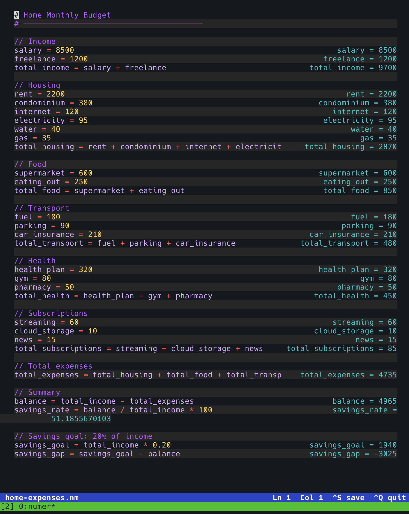

# numer

A terminal calculator inspired by [Numi](https://numi.app) and [Soulver](https://soulver.app). Write math expressions in a multi-line editor and see results instantly.



## Install

```sh
go install github.com/gfonseca/numer@latest
```

Or build from source:

```sh
git clone https://github.com/gfonseca/numer
cd numer
go build -o numer .
```

## Usage

```sh
numer              # start a blank session
numer file.nm      # open an existing sheet
```

## Editor

numer works like a simple text editor (nano-style). Each line is evaluated as you type and the result appears on the right column.

| Key        | Action                        |
|------------|-------------------------------|
| Arrow keys | Move cursor                   |
| Home / End | Start / end of line           |
| PgUp/PgDn  | Scroll by page                |
| Enter      | New line                      |
| Backspace  | Delete character left         |
| Delete     | Delete character right        |
| Ctrl+K     | Kill (delete) to end of line  |
| Ctrl+A     | Move to start of line         |
| Ctrl+E     | Move to end of line           |
| Ctrl+Z     | Undo                          |
| Ctrl+Y     | Redo                          |
| Ctrl+S     | Save                          |
| Ctrl+Q     | Quit                          |

Lines scroll horizontally when they exceed the editor width.

## File Format

Sheets are plain text files (`.nm` by convention). Each line is one expression. You can open them in any text editor.

When saving an untitled session (`Ctrl+S`), numer prompts for a file path at the bottom of the screen.

## Expressions

### Arithmetic

| Operator | Meaning        | Example        |
|----------|----------------|----------------|
| `+`      | Addition       | `10 + 5`       |
| `-`      | Subtraction    | `10 - 5`       |
| `*`      | Multiplication | `3 * 4`        |
| `/`      | Division       | `10 / 4` → `2.5` |
| `%`      | Modulo         | `10 % 3` → `1` |
| `^`      | Power          | `2 ^ 10` → `1024` |
| `(` `)` | Grouping       | `(1 + 2) * 3`  |

Power is right-associative: `2 ^ 3 ^ 2` = `2 ^ (3 ^ 2)` = `512`.

### Variables

Assign with `=`. Variable names are case-insensitive.

```
price = 100
discount = 0.2
price - price * discount
```

The special variable `last` always holds the result of the previous evaluated line:

```
100 * 1.1
last * 1.1
last * 1.1
```

### Constants

| Name  | Value               |
|-------|---------------------|
| `pi`  | 3.14159265358979... |
| `e`   | 2.71828182845904... |
| `tau` | 6.28318530717958... (2π) |
| `phi` | 1.61803398874989... (golden ratio) |

### Functions

| Function        | Description                          | Args |
|-----------------|--------------------------------------|------|
| `sqrt(x)`       | Square root                          | 1    |
| `abs(x)`        | Absolute value                       | 1    |
| `floor(x)`      | Round down                           | 1    |
| `ceil(x)`       | Round up                             | 1    |
| `round(x)`      | Round to nearest integer             | 1    |
| `sin(x)`        | Sine (radians)                       | 1    |
| `cos(x)`        | Cosine (radians)                     | 1    |
| `tan(x)`        | Tangent (radians)                    | 1    |
| `asin(x)`       | Arc sine                             | 1    |
| `acos(x)`       | Arc cosine                           | 1    |
| `atan(x)`       | Arc tangent                          | 1    |
| `atan2(y, x)`   | Arc tangent of y/x                   | 2    |
| `log(x)` / `ln(x)` | Natural logarithm              | 1    |
| `log2(x)`       | Base-2 logarithm                     | 1    |
| `log10(x)`      | Base-10 logarithm                    | 1    |
| `exp(x)`        | e raised to the power x              | 1    |
| `pow(x, y)`     | x raised to the power y              | 2    |
| `max(a, b, ...)` | Maximum of arguments               | 1+   |
| `min(a, b, ...)` | Minimum of arguments               | 1+   |
| `sum(a, b, ...)` | Sum of all arguments               | 0+   |

### Comments

Lines starting with `#` or `//` are treated as comments and produce no result.

```
# monthly budget
salary = 5000
// expenses
rent = 1200
salary - rent
```

### sum-total

Type `sum-total` on any line to draw a separator and display the running total of all numeric results above it. The accumulator resets after each `sum-total`, so you can use it multiple times in the same sheet without double-counting.

```
# January
rent = 1200
groceries = 300
utilities = 150
sum-total           →  1650

# February
rent = 1200
groceries = 280
utilities = 140
sum-total           →  1620
```

The `sum-total` keyword is case-insensitive. Its result is also stored in `last`.
